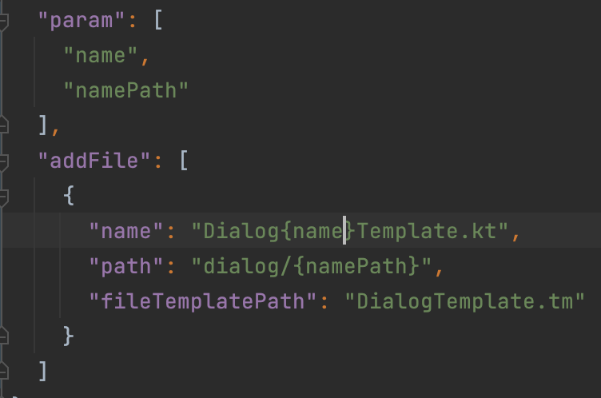
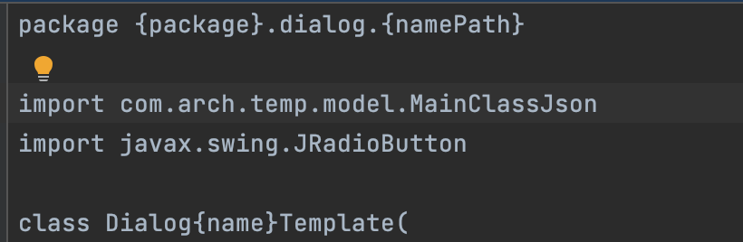
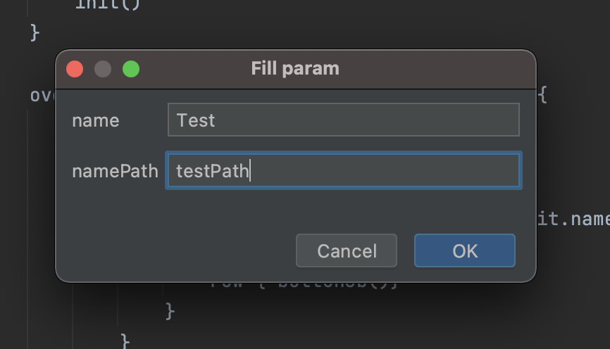
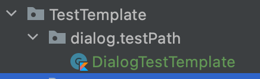
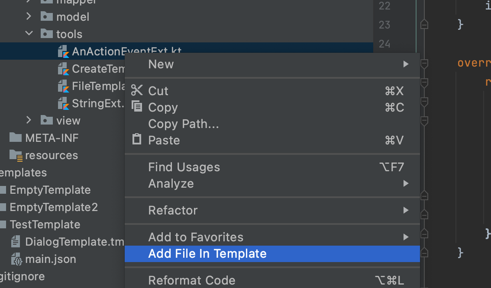
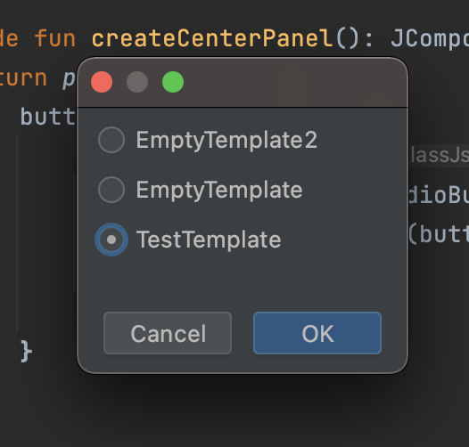
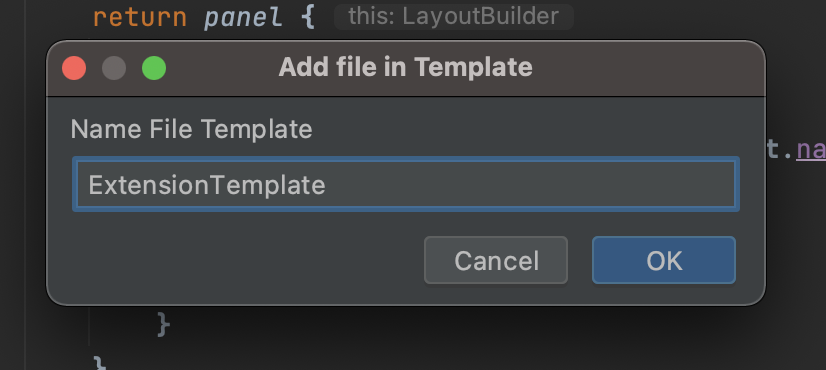
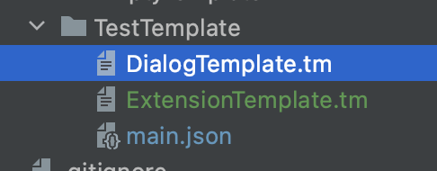
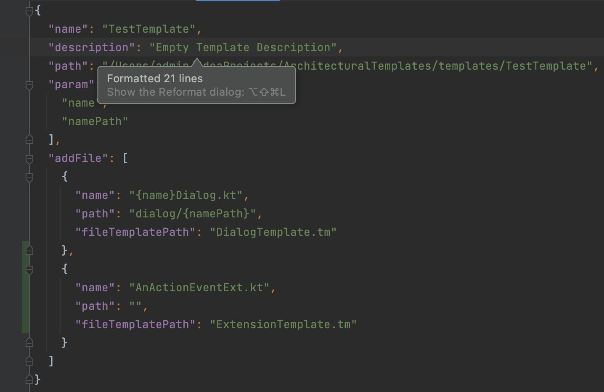

# Group File Template (GFT) IDEA Plugin

[](https://github.com/Louco11/ArchitecturalTemplates/wiki/Release-Notes)
[](https://plugins.jetbrains.com/plugin/16836-architectural-templates)
[](http://www.apache.org/licenses/LICENSE-2.0.html)
[](https://www.buymeacoffee.com/doronec)

Plugin create a group of files by custom templates from IDEA interface.

[Version 4.4](https://github.com/Louco11/Group-File-Template-GFT/wiki/Release-Notes)

# Quick start
[Templates Example](https://github.com/Louco11/Group-File-Template-GFT/tree/master/templates/TestTemplate)

First of all install the [Plugin From Marketplace](https://plugins.jetbrains.com/plugin/16836-architectural-templates).

```
IMPORTANT!!! If, when creating a "Template, Files" or adding a file to templates, 
there were no changes in the Project Catalog. Then remove the focus from the IDEA 
and return it back, THE PROBLEM IS UNDERSTANDING !!
```

To create an empty template, click on the `"Tools"` -> `"Create New Template"` menu item


In the Dialog box enter the name of the template


The plugin will create an empty template at the root of your project.

All templates are stored in the folder `"Your project name"/templates`


The heart of the template is the Json file Main


Inside it has a structure

| Key            |	Value                                                |	Comment                 |
|----------------|-------------------------------------------------------|--------------------------|
| name           |	Name Template                                        |                          |
| description    |	Description Template                                 |                          |
| path           |	Path to Template                                     |                          |
| param          |	Variables to insert into the template                |	list String             |
| selectParam    |	Variables to drop list with values into the template |	list object SelectParam |
| addFile        |	Files to create                                      |	list object File        |

structure `SelectParam`

| Key           | Value	                                | comment       |
|---------------|---------------------------------------|---------------|
| paramName     | Variables to insert into the template |               |
| paramValue    | values                	            | list String   |

### param

The parameter is an array of strings. It can be in the File Structure in name and path. 
And also in the template itself. It is declared in brackets `{param}`.

Options after param:
* `[-s]` - snake_case
* `[-C]` - CamelCase
* `[-c]` - camelCase
* `[-p]` - point.between.words
* `[-sl]` - slash/between/word
* `[-d]` - dash-between-word

example {"NewFeature"}[-s] equals new_feature

Example




Default parameter for Java and Kotlin `{package}` and `{pack}` for R.class example `import {pack}.R`

`{time}` = 10:56

`{day}` = 04

`{month}` = 06

`{year}` = 2022

When creating files from a template, the plugin will correct to fill in the parameter fields.




### File it has a structure

| Key               |	Value                                                   |	Comment                                                                                                  |
|-------------------|-----------------------------------------------------------|------------------------------------------------------------------------------------------------------------|
| name              |	Name when creating a file                               |	You can use Param in the name                                                                            |
| path              |	Additional directories for saving                       |	You can use Param in the name. Creates a catalog automatically if it does not exist                      |
| fileTemplatePath  |	The name of the template from which the file is created |	It must be specified with the extension .tm and you can specify the directory where this file is located |

If file name empty then create only directory

To add resources to android, write the `"res/"` to the parameter `"path"` parameter

To add test to android, write the `"test/"` to the parameter `"path"` parameter

To add file in path project, write the `"~/"` to the parameter `"path"` parameter

# Create Template

To create a file from a template, right-click on the path in which 
we want to create and select the template we need from the list


### Add File In Template

To add a file to the template, right-click on it and select `"Add file in template"` 
The plugin will ask you to choose which template you want to add (if there are several of them) 
and will ask you to rename the file as it will be named in the template.







# License

```
Copyright 2022 Doroncov Mihail

Licensed under the Apache License, Version 2.0 (the "License");
you may not use this file except in compliance with the License.
You may obtain a copy of the License at

   http://www.apache.org/licenses/LICENSE-2.0

Unless required by applicable law or agreed to in writing, software
distributed under the License is distributed on an "AS IS" BASIS,
WITHOUT WARRANTIES OR CONDITIONS OF ANY KIND, either express or implied.
See the License for the specific language governing permissions and
limitations under the License.
```
