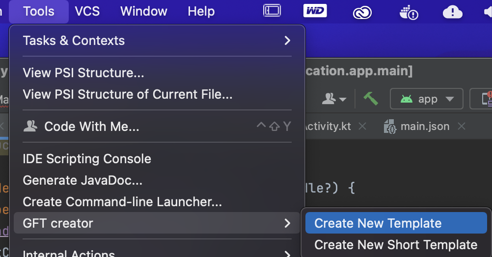
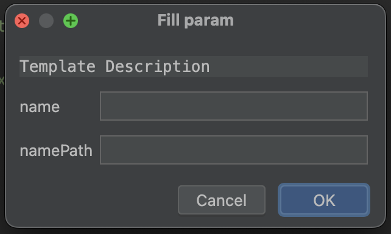

# Group File Template (GFT) IDEA Plugin

[](https://github.com/Louco11/ArchitecturalTemplates/wiki/Release-Notes)
[](https://plugins.jetbrains.com/plugin/16836-architectural-templates)
[](http://www.apache.org/licenses/LICENSE-2.0.html)

Plugin create a group of files by custom templates from IDEA interface.

[Version 5.2](https://github.com/Louco11/Group-File-Template-GFT/wiki/Release-Notes)
## ARTICLES
### Medium
- https://medium.com/@Doronec/how-to-create-modules-with-all-the-bindings-for-the-project-like-thanos-snap-ebf40fec8cd6
- https://medium.com/@Doronec/create-a-plugin-for-jetbrains-ide-how-to-display-a-directory-not-from-a-project-in-the-project-510aaf42fa1c

### Habr
- https://habr.com/ru/companies/cian/articles/740928/
- https://habr.com/ru/companies/cian/articles/816149/

# Quick start
[Templates Example](https://github.com/Louco11/Group-File-Template-GFT/tree/master/templates)

First of all install the [Plugin From Marketplace](https://plugins.jetbrains.com/plugin/16836-architectural-templates).

## Short Template
To create an empty short template, click on the `"Tools"` -> `"GFT Creator"` -> `"Create New Short Template"` menu item


### Add a piece of code to short templates

- Highlight code
- Right-click on the highlight code
- Choose `"Add in Template"`


- If there is more than one template, choose which one to save it to, otherwise the plugin will add it to the only created template
- Enter the name of the short template


### Use short templates

Right-click or generic menu


### Structure short templates

The heart of the short template is the Json file main_short

| Key            | 	Value                      |	Comment                 |
|----------------|-----------------------------|--------------------------|
| name           | 	Name Short Template        |                          |
| description    | 	Description Short Template |                          |
| addFile        | 	Files to create            |	list object File        |

structure `addFile`

| Key        | Value	                              | comment |
|------------|-------------------------------------|---------|
| name       | name short template in menu         |         |
| filePath   | file with template                	 |         |


## Template
To create an empty template, click on the `"Tools"` -> `"GFT Creator"`->`"Create New Template"` menu item



In the Dialog box enter the name of the template


The plugin will create an empty template at the root of your project.

All templates are stored in the folder `"Your project name"/templates`


The heart of the template is the Json file Main

Inside it has a structure

| Key            | 	Value                                                | 	Comment                   |
|----------------|-------------------------------------------------------|----------------------------|
| name           | 	Name Template                                        |                            |
| description    | 	Description Template                                 |                            |
| param          | 	Variables to insert into the template                | 	list String               |
| selectParam    | 	Variables to drop list with values into the template | 	list object SelectParam   |
| addFile        | 	Files to create                                      | 	list object File          |
| insertInFile   | 	Insert in file structure                             | 	list object InsertInFile  |

structure `SelectParam`

| Key           | Value	                                | comment       |
|---------------|---------------------------------------|---------------|
| paramName     | Variables to insert into the template |               |
| paramValue    | values                	            | list String   |

### param

The parameter is an array of strings. It can be in the File Structure in name and path. 
And also in the template itself. It is declared in brackets `{param}`.

Options after param:
* `[-S]` - SCREAMING_SNAKE_CASE
* `[-s]` - snake_case
* `[-C]` - CamelCase
* `[-c]` - camelCase
* `[-p]` - point.between.words
* `[-sl]` - slash/between/word
* `[-d]` - dash-between-word

example {"NewFeature"}[-s] equals new_feature

Example


Default parameter for Java and Kotlin `{package}` and `{pack}` for R.class example `import {pack}.R`

`{time}` = 10:56

`{day}` = 04

`{month}` = 06

`{year}` = 2022

When creating files from a template, the plugin will correct to fill in the parameter fields.




### File it has a structure

| Key                |	Value                                                   |	Comment                                                                                                  |
|--------------------|-----------------------------------------------------------|------------------------------------------------------------------------------------------------------------|
| name               |	Name when creating a file                               |	You can use Param in the name                                                                            |
| path               |	Additional directories for saving                       |	You can use Param in the name. Creates a catalog automatically if it does not exist                      |
| fileTemplatePath   |	The name of the template from which the file is created |	It must be specified with the extension .tm and you can specify the directory where this file is located |

If file name empty then create only directory

To add resources to android, write the `"res/"` to the parameter `"path"` parameter

To add test to android, write the `"test/"` to the parameter `"path"` parameter

To add file in path project, write the `"~/"` to the parameter `"path"` parameter

### InsertInFile it has a structure

| Key              | 	Value                                         | 	Comment                                                                                                 |
|------------------|------------------------------------------------|----------------------------------------------------------------------------------------------------------|
| line             | 	Position line insert                          | 	                                                                                                        |
| path             | 	Path to the file where to paste the code      | Path in project to file. You can use Param in the name.                                                                                |
| fileTemplatePath | 	The name of the template from insert the code | It must be specified with the extension .tm and you can specify the directory where this file is located |

if line == 0, insert code at the beginning of the file
if line == -1, code insert in end file
if count line > size line in file, insert the code at the end of the file

# Create Template

To create a file from a template, right-click on the path in which 
we want to create and select the template we need from the list


### Add File In Template

To add a file to the template, right-click on it and select `"Add file in template"` 
The plugin will ask you to choose which template you want to add (if there are several of them) 
and will ask you to rename the file as it will be named in the template.


### Add new line insert in Template
- In the file in which we want to insert, right-click on the line we need.
- Select in the context menu `Add Insert From Template`
- Select the template from which the insert will be made
- In fileTemplatePath we specify the template from which the insertion will be made
- When creating new files, an insertion will be made into the file we selected


### Move template in IDE

In the project tool window, a new field is GFTemplate.


Having selected we will be shown all our templates in the project and in the IDE


You can move templates from a project to an IDE and back.
`ide/templates` or `project/templates`

To move or copy a template in a view or into a project. 
Right-click on the template and select `Copy Template` or `Move Template`


After this we can rename the template.


# License

```
Copyright 2021 Doroncov Mihail

Licensed under the Apache License, Version 2.0 (the "License");
you may not use this file except in compliance with the License.
You may obtain a copy of the License at

   http://www.apache.org/licenses/LICENSE-2.0

Unless required by applicable law or agreed to in writing, software
distributed under the License is distributed on an "AS IS" BASIS,
WITHOUT WARRANTIES OR CONDITIONS OF ANY KIND, either express or implied.
See the License for the specific language governing permissions and
limitations under the License.
```
